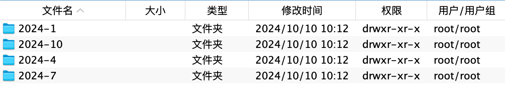

# Ani-strm

一个将aniopen番剧全部转成strm

<div align="center">
	
</div>
<div align="center">
	
</div>
<div align="center">
	
</div>

> 非常感谢 [aniopen](https://openani.an-i.workers.dev/) TG:[Channel_ANi](https://t.me/channel_ani)

> [测试站](https://0m.ee/)>  [免梯镜像站](https://ani.0m.ee/)
## 📜公告通知

- 本程序为开源项目，不接受任何形式的催单和索取行为，更不容许存在付费内容
- 本程序仅供学习交流，请勿用于非法用途

## 🧑‍🏭准备工作

- Python3以上
- 安装依赖

```shell script
- pip install aiohttp aiofiles loguru apscheduler
```

- 运行程序

```shell script
- python ani.py
```

## 注意事项

###### 1.提示没有兼容的流
###### 解决方法进入容器内部执行以下代码

```shell script
- docker exec -it emby容器名 /bin/sh
- cp /system/dashboard-ui/modules/htmlvideoplayer/basehtmlplayer.js /system/dashboard-ui/modules/htmlvideoplayer/basehtmlplayer.js_backup
- sed -i 's/mediaSource\.IsRemote&&"DirectPlay"===playMethod?null:"anonymous"/null/g' /system/dashboard-ui/modules/htmlvideoplayer/basehtmlplayer.js
```
此方法来自https://github.com/bpking1/embyExternalUrl/blob/main/FAQ.md
